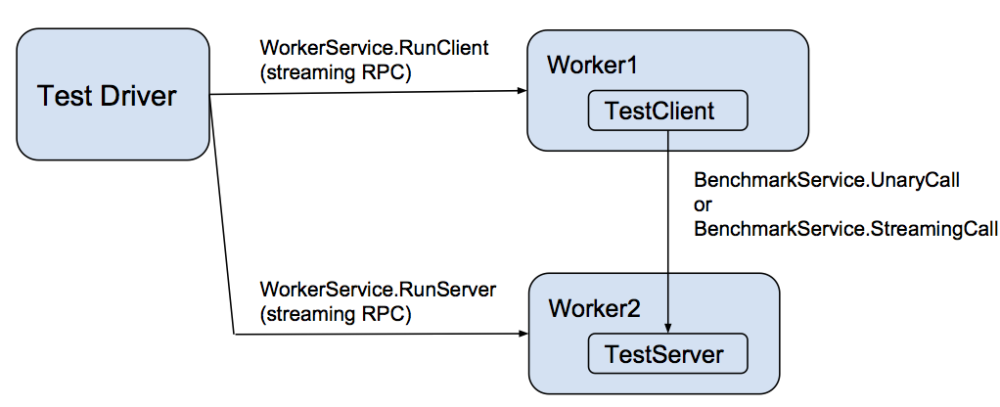

# 基准测试

`gRPC`旨在支持多种语言的高性能开源`RPC`。本文档介绍了性能基准测试工具，测试所考虑的场景以及测试基础结构。

## 总览
`gRPC`专为分布式应用程序的高性能和高生产率设计而设计。持续的性能基准测试是`gRPC`开发工作流程的关键部分。针对`master`分支每小时进行一次多语言性能测试，并将这些数字报告给仪表板以进行可视化。

- [多语言性能仪表板`@latest_release`（最新可用的稳定版本）](https://performance-dot-grpc-testing.appspot.com/explore?dashboard=5636470266134528)
- [多语言性能仪表板`@master`（最新开发版本）](https://performance-dot-grpc-testing.appspot.com/explore?dashboard=5652536396611584)
- [`C++`详细性能仪表板`@master`（最新开发版）](https://performance-dot-grpc-testing.appspot.com/explore?dashboard=5685265389584384)

## 性能测试设计
每种语言都实现了性能测试工作程序，该工作程序实现了`gRPC WorkerService`。此服务指示工作程序充当实际基准测试的客户端或服务器，表示为 `BenchmarkService`。该服务有两种方法：

- `UnaryCall`-简单请求的一元`RPC`，它指定要在响应中返回的字节数
- `StreamingCall`-一种流式`RPC`，它允许对请求和响应消息进行反复的`ping-ping`，类似于`UnaryCall`

这些工作程序由一个驱动程序控制，该[驱动程序]()将场景描述（`JSON`格式）和一个环境变量指定为输入，该环境变量指定每个工作进程的`host：port`。

## 被测语言
作为主客户端和服务器，以下语言进行了持续的性能测试：

- `C++`
- `Java`
- `Go`
- `C#`
- `node.js`
- `Python`
- `Ruby`

此外，所有从`C`核派生的语言都对每个请求请求进行了有限的性能测试（烟雾测试）。

除了作为性能测试的客户端和服务器端运行之外，所有语言都针对`C++`服务器作为客户端进行测试，针对`C++`客户端作为服务器进行测试。此测试旨在提供给定语言的客户端或服务器实现的当前性能上限，而无需测试另一端。

尽管`PHP`或移动环境不支持`gRPC`服务器（这是我们的性能测试所必需的），但是可以使用以另一种语言编写的代理`WorkerService`来对它们的客户端性能进行基准测试。该代码是为PHP实现的，但尚未处于连续测试模式。

## 测试场景
有几个重要的场景正在测试中，并显示在上面的仪表板中，其中包括：

- 无争用延迟-仅1个客户端使用`StreamingCall`一次发送一条消息时看到的中值和尾部响应延迟
- `QPS`-当有2个客户端和总共64个通道（每个通道使用`StreamingCall`一次发送100条未完成的消息）时的消息/秒速率
可伸缩性（针对某些语言）-每个服务器核心每秒的消息数

大多数性能测试都使用安全的通信和协议。一些`C++`测试还使用不安全的通信和通用（非`protobuf`）`API`来显示最佳性能。将来可能会添加其他方案。

## 测试基础架构
通过我们的`Jenkins`测试基础架构，所有性能基准都作为`GCE`中的实例运行。除了上述的`gRPC`性能方案外，我们还运行基线`netperf TCP_RR`延迟数，以了解底层的网络特征。这些数字显示在我们的仪表板上，有时会根据实例在`GCE`中的分配位置而有所不同。

大多数测试实例是8核系统，并且用于延迟和`QPS`测量。对于`C++`和`Java`，我们还支持在32核系统上进行`QPS`测试。所有`QPS`测试针对每个服务器使用2台相同的客户端计算机，以确保`QPS`度量不受客户端限制。